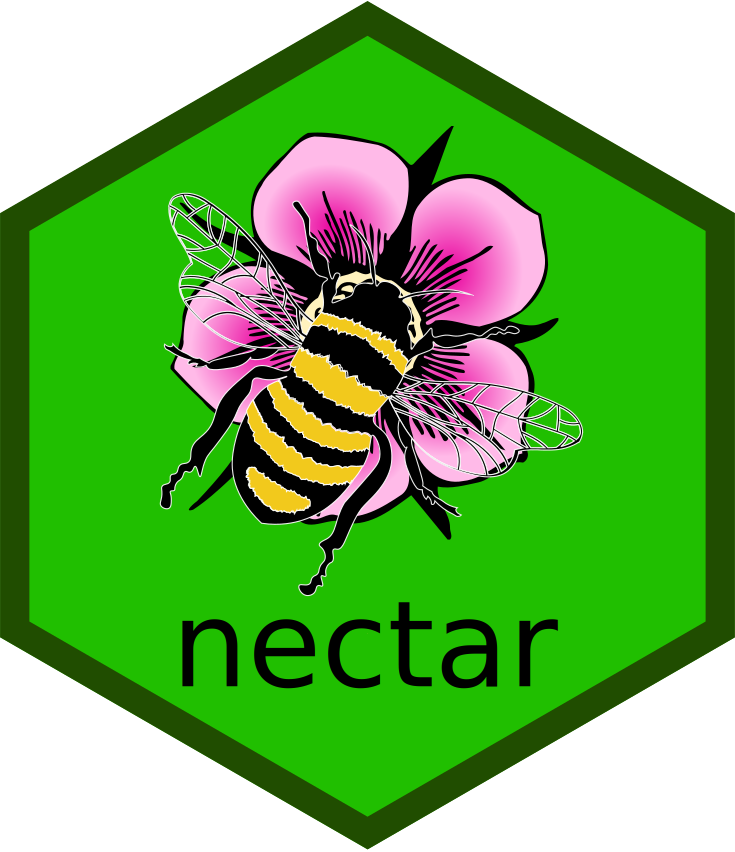

<!-- README.md is generated from README.Rmd. Please edit that file -->

```{r, include = FALSE}
knitr::opts_chunk$set(
  collapse = TRUE,
  comment = "#>",
  fig.path = "man/figures/README-",
  out.width = "100%"
)
```

# nectar <a href="https://nectar.api2r.org"></a>

<!-- badges: start -->
[](https://lifecycle.r-lib.org/articles/stages.html#experimental)
[](https://CRAN.R-project.org/package=nectar)
[](https://app.codecov.io/gh/jonthegeek/nectar?branch=main)
[](https://github.com/jonthegeek/nectar/actions/workflows/R-CMD-check.yaml)
<!-- badges: end -->

An opinionated framework for use within api-wrapping R packages.

## Installation

You can install the development version of nectar from [GitHub](https://github.com/) with:

``` r
# install.packages("remotes")
remotes::install_github("jonthegeek/nectar")
```

## Usage

Add usage information and examples here.

## Code of Conduct

Please note that the nectar project is released with a [Contributor Code of Conduct](https://nectar.api2r.org/CODE_OF_CONDUCT.html). By contributing to this project, you agree to abide by its terms.
